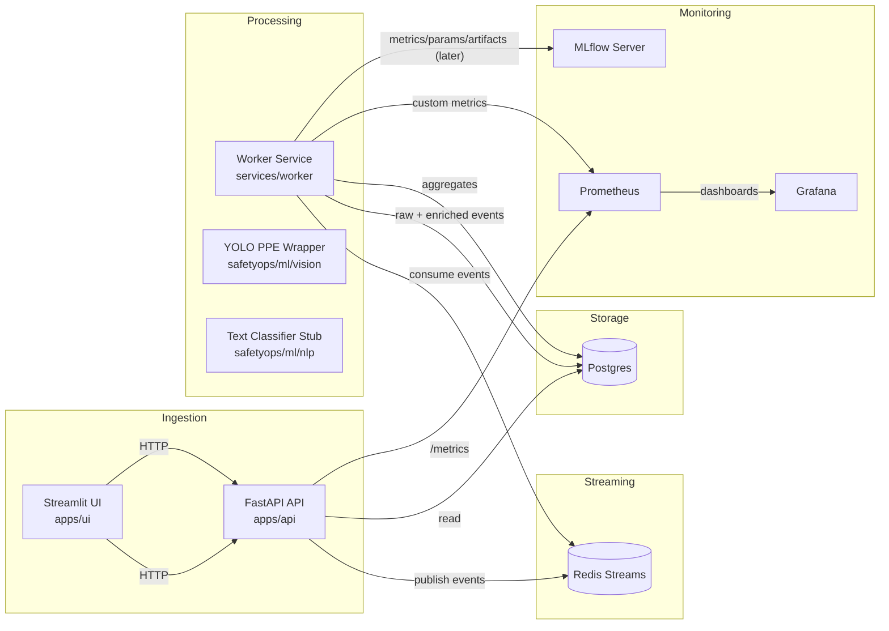

# Architecture — SafetyOps Copilot (v1)

This document describes the high-level architecture of SafetyOps Copilot, focusing on **components**, **data flow**, and **runtime topology**.

---

## 1. Component Overview

### Core services

- **FastAPI service (`apps/api`)**
  - Ingests `text_event` and `vision_event`.
  - Provides read APIs for recent enriched events and aggregates.
  - Exposes `/health` and `/metrics` for monitoring and CI checks.
  - Exposes `/copilot/triage` for the multi-step triage workflow.
  - Exposes `/monitoring/drift/*` and DLQ management endpoints.
- **Worker service (`services/worker`)**
  - Consumes events from Redis Streams using consumer groups.
  - Runs:
    - YOLOv8-based PPE detection (vision).
    - NLP severity model (DistilBERT) + rule-based category classification (text).
  - Persists raw and enriched events into Postgres.
  - Computes a per-event `risk_score` and maintains daily and hourly aggregates.
  - Implements idempotent processing and a DLQ stream with retries and backoff.
- **UI service (`apps/ui`)**
  - Streamlit-based dashboard.
  - Generates demo events.
  - Surfaces live enriched events and aggregates.
  - Provides:
    - **Incident Triage** form.
    - **Copilot Chat** tab that calls `/copilot/triage`.
    - **Monitoring** tab for drift reports and metrics summary.

### Shared Python package (`safetyops`)

- `core/` – settings, logging, shared exceptions.
- `domain/` – Pydantic models for events, predictions, and API schemas.
- `ml/` – ML wrappers:
  - `vision/` – YOLO PPE wrapper with lazy imports + optional training.
  - `nlp/` – rule-based classifier plus DistilBERT fine-tune & inference.
- `streaming/` – Redis Streams abstraction (`BaseEventBus` + Redis implementation).
- `db/` – SQLAlchemy models, engine/session helpers, and migration scaffold.
- `monitoring/` – Prometheus metrics helpers and Evidently drift integration.
- `agents/` – triage workflow orchestration and multi-step reasoning.
- `runbooks/` – markdown incident response playbooks used by the triage agent.

### Infra (`infra/`)

Brought up via `docker-compose.local.yml`:

- **Postgres** – event and aggregate storage.
- **Redis** – primary event stream (Redis Streams).
- **MLflow** – experiment tracking and artifact store.
- **Prometheus** – metrics scraping (API /metrics).
- **Grafana** – basic dashboarding (config minimal/placeholder).

Notebooks (`/notebooks`) provide EDA and architecture walkthroughs.

---

## 2. Data Flow

### 2.1 Event ingestion

1. A user or integration calls:
   - `POST /events/text` with incident text and metadata; or
   - `POST /events/vision` with an image path or upload.
2. FastAPI:
   - Validates request using Pydantic models (`safetyops.domain.events`).
   - Wraps payload in a **normalized event envelope** with:
     - `id` (UUID)
     - `event_type` (`text_event` or `vision_event`)
     - `created_at`
     - `correlation_id`
     - `source`
   - Publishes the envelope to the event bus (`BaseEventBus.publish`).
3. The `RedisStreamsEventBus`:
   - Serializes the event envelope as JSON.
   - Appends to Redis Stream (`XADD`) under key `SAFETYOPS_STREAM_KEY`.

---

### 2.2 Event processing (worker)

1. Worker on startup:
   - Configures logging and metrics.
   - Creates Redis Streams consumer group (idempotent).
   - Creates a DB engine + session factory.
2. Main loop:
   - Calls `event_bus.consume(...)` to read from Redis Streams with a consumer group:
     - Uses `XREADGROUP group consumer &gt;` with blocking (e.g., 5s).
   - For each message:
     - Parses JSON into a Pydantic `EventEnvelope`.
     - Stores a `RawEvent` row in Postgres.
     - Runs **enrichment**:
       - Text events:
         - Rule-based classifier extracts `category`, `severity`, `confidence`.
       - Vision events:
         - YOLO PPE wrapper computes:
           - number of persons
           - number with PPE
           - `compliance_score` ∈ [0, 1].
         - If YOLO is unavailable (e.g., tests, minimal CI), logs a warning and falls back to a stub.
     - Stores an `EnrichedEvent` row with predictions.
     - Updates/creates a `DailyAggregate` row for `(date, event_type, severity)`.
     - Acknowledges the message (`XACK`).

Errors are logged and captured by metrics but **do not crash** the worker loop.

---

### 2.3 Query and visualization

- **API**
  - `/events/recent`:
    - Queries `enriched_events` ordered by `created_at` (limit N).
  - `/aggregates/summary`:
    - Aggregates `daily_aggregates` over a recent window (e.g., last 7 days).
- **Streamlit UI**
  - Uses `httpx` to call the FastAPI API.
  - Tabs:
    - **Live Feed**:
      - Button to produce N demo events via the API or a helper script.
      - Live table of recent enriched events (periodic refresh).
    - **Incident Triage**:
      - Text box and submit button posting to `/events/text`.
      - Fetches and displays the latest triaged text events.
    - **Ops Dashboard**:
      - Queries `/aggregates/summary`.
      - Renders simple charts (matplotlib) and placeholder links for later monitoring features.

---

## 3. Logical Architecture Diagram

---

## 4. Runtime Topology

### Local development (recommended)

- Infra services run in Docker via `infra/docker-compose.local.yml`:
  - `postgres:5432`
  - `redis:6379`
  - `mlflow:5000`
  - `prometheus:9090`
  - `grafana:3000`
- Application processes run on the host:
  - FastAPI (Uvicorn) on `localhost:8000`
  - Streamlit UI on `localhost:8501`
  - Worker (`python -m services.worker.run`)

This keeps the stack aligned with **free tier constraints** and simplifies debugging (no need to rebuild images for code changes).

### Future deployment

Later prompts can introduce:

- Containerization for API/UI/worker.
- Free-tier friendly platforms (e.g., Fly.io, Render, Railway) for API/worker.
- Managed Redis/Postgres.
- Lightweight MLflow/Prometheus/Grafana deployment.

---

## 5. Key Design Choices

Summarized here; details are in `03_DECISIONS_LOG.md`:

- **Redis Streams**: native, lightweight message bus for real-time events.
- **Postgres**: single source of truth for raw, enriched events and aggregates.
- **YOLO (vision)**: leverage pre-trained `yolov8n` for PPE detection with lazy imports for CI friendliness.
- **Stub text classifier**: simple rule-based logic to start; will be replaced or augmented later.
- **Streamlit UI**: fast iteration and easy hosting on free tiers.
- **FastAPI**: typed, async-friendly API with strong ecosystem support.